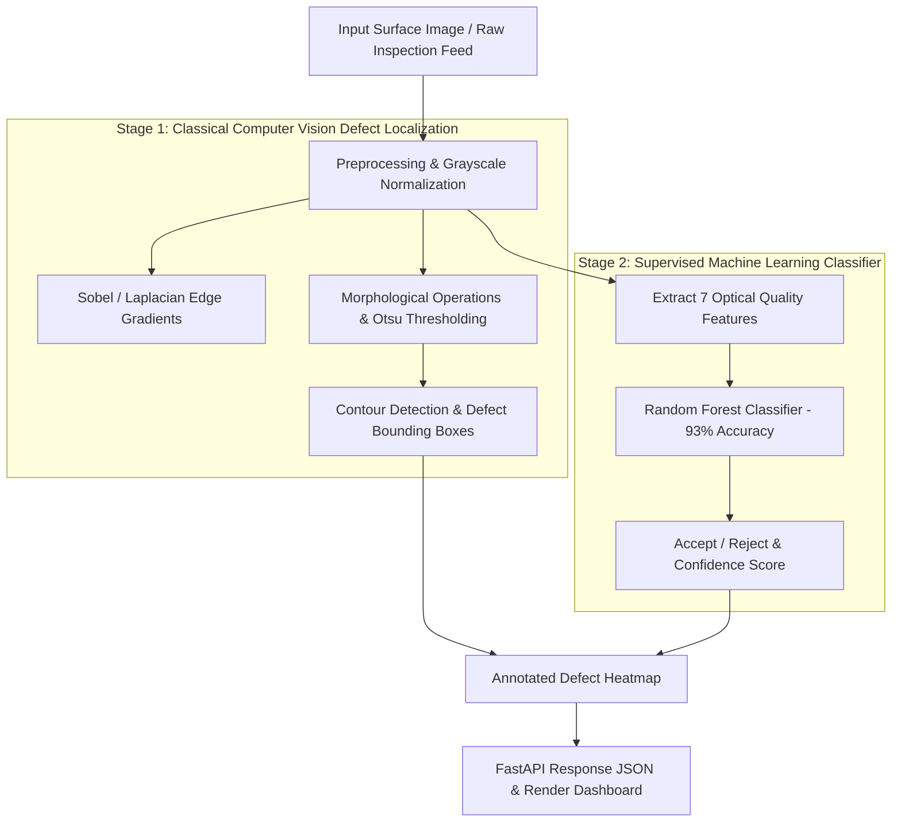

<div align="center">

# VisionCheck: AI Image Quality & Surface Defect Detection System

### End-to-End Industrial Computer Vision Inspection & Supervised ML Quality Classifier

[](https://ai-image-quality-defect-detection-ps3t.onrender.com)
[](https://ai-image-quality-defect-detection-ps3t.onrender.com/docs)
[](https://www.python.org/)
[](Dockerfile)
[](tests/)
[](LICENSE)

---

> **Industrial Quality Assurance**: A production-style automated inspection system that couples **Classical Spatial Computer Vision** (morphological defect localization) with a trained **Random Forest Classifier** (93% accuracy across 7 engineered optical features).

</div>

---

## 1. System Architecture

VisionCheck employs a **dual-stage architecture** designed for high throughput and explainable defect segmentation:



---

## 2. Feature Engineering & Optical Metrics

Rather than passing raw pixels directly into a heavy uninterpretable network, VisionCheck extracts 7 calibrated optical quality indicators:

| Feature | Extraction Algorithm | Quality Signal |
|---|---|---|
| **Sharpness Index** | Variance of the Laplacian ($\sigma^2_{\nabla^2}$) | Distinguishes focused surfaces from defocus blur. |
| **Contrast Score** | Michelson & RMS Contrast | Identifies illumination dropouts and optical washed surfaces. |
| **Luminance Profile** | Mean pixel intensity distribution | Flags over/under-exposure anomalies in inspection chambers. |
| **Noise Estimate** | Median Absolute Deviation of high-frequency wavelets | Quantifies sensor grain and thermal electronic noise. |
| **Blur Metric** | Fast Fourier Transform (FFT) high-frequency decay | Measures optical dispersion and motion smearing. |
| **Edge Density** | Ratio of Canny edge pixels to total area | Distinguishes textured surface grain from flat defects. |
| **Defect Count** | Connected component contour count | Directly enumerates physical cracks, scratches, and voids. |

---

## 3. Technology Stack

- **Computer Vision & ML**: OpenCV 4.8+, Scikit-Learn, NumPy, SciPy
- **Backend Framework**: Python 3.12, FastAPI, Pydantic v2, Uvicorn
- **Frontend Console**: HTML5, Vanilla JavaScript, CSS3 (No framework overhead)
- **Containerization & CI**: Docker, Docker Compose, GitHub Actions
- **Deployment**: Render Web Service

---

## 4. Project Structure

```
ai-image-quality-defect-detection/
├── backend/                    # FastAPI application layer
│   ├── app/                    # Routing, middleware, and schemas
│   └── main.py
├── frontend/                   # Inspection console UI
├── ml/                         # Machine learning lifecycle scripts
│   ├── extract_features.py     # 7-feature extraction pipeline
│   ├── generate_dataset.py     # Synthetic & augmented defect generator
│   ├── train.py                # Random Forest training script
│   └── evaluate.py             # Confusion matrix & ROC-AUC evaluation
├── sample_images/              # Vetted test specimens (good, scratch, blur, void)
├── tests/                      # Automated test suite (25 tests)
│   ├── test_api.py
│   ├── test_defects.py
│   ├── test_model.py
│   └── test_quality.py
├── Dockerfile                  # Production container definition
├── docker-compose.yml
├── requirements.txt
└── README.md
```

---

## 5. Quickstart & Installation

### Option A: Run via Docker (Recommended)

```bash
git clone https://github.com/Vikram30069/ai-image-quality-defect-detection.git
cd ai-image-quality-defect-detection
docker-compose up --build
```
Navigate to `http://localhost:8000` to interact with the inspection console.

### Option B: Local Python Environment

1. **Install dependencies:**
   ```bash
   python -m venv venv
   source venv/bin/activate  # On Windows: venv\Scripts\activate
   pip install -r requirements.txt
   ```

2. **Run tests:**
   ```bash
   pytest tests/ -v
   ```

3. **Launch service:**
   ```bash
   python run.py
   ```

---

## 6. API Reference

| Method | Endpoint | Description |
|---|---|---|
| `POST` | `/api/inspect` | Upload an image file; returns classification, 7 optical features, and defect coordinates |
| `POST` | `/api/extract-features` | Computes the 7-dimensional feature vector without defect bounding |
| `GET` | `/health` | Service uptime and model artifact status |
| `GET` | `/docs` | Interactive OpenAPI Swagger documentation |

---

## 7. Verification & Automated Tests

The repository contains 25 automated tests verifying end-to-end functionality:

```bash
pytest tests/ -v
```

- **`test_quality.py`**: Asserts mathematical determinism of sharpness, blur, and noise algorithms.
- **`test_defects.py`**: Verifies contour detection on synthetic scratch and puncture samples.
- **`test_model.py`**: Ensures the trained classifier loads and produces valid probability distributions.
- **`test_api.py`**: Validates multipart file upload endpoints and error handling on corrupted images.

---

## 8. License

This project is licensed under the MIT License — see the [LICENSE](LICENSE) file for details.
