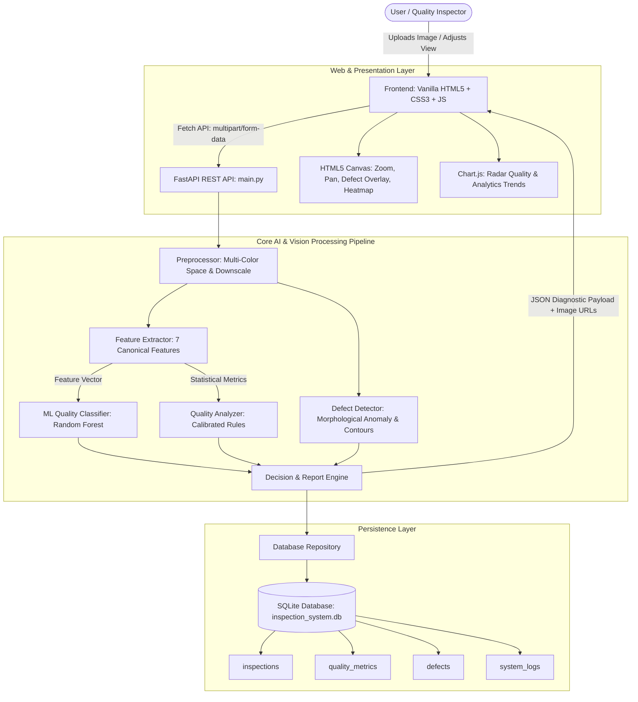
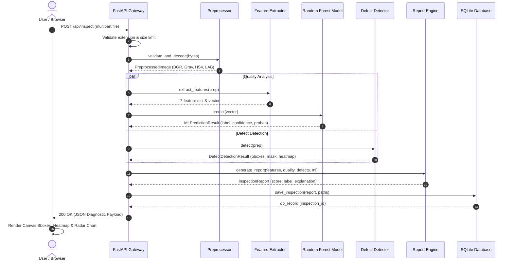

# System Architecture & Technical Design

## 1. High-Level Architectural Blueprint

The **AI-Powered Image Quality & Visual Defect Detection System** follows a decoupled, modular 3-tier architecture adhering to Clean Architecture principles:

---

## 2. Component Responsibility Matrix

| Component Layer | Primary File | Responsibility |
| :--- | :--- | :--- |
| **Presentation (UI)** | `frontend/index.html`, `js/app.js` | Single-page interface, interactive dual-canvas zoom/pan, defect toggles, Chart.js radar & trend visualizers. |
| **API & Gateway** | `backend/app/main.py`, `routes/` | HTTP request routing, multipart file validation, CORS, static file serving, error handling. |
| **Preprocessing** | `backend/app/core/preprocessor.py` | Safe image decoding, dimension bounding, color space transformations (BGR, Grayscale, HSV, LAB). |
| **Feature Engineering** | `backend/app/core/feature_extractor.py` | Extracts 7 canonical interpretable features: Sharpness, Brightness, Contrast, Noise, Entropy, Saturation, Edge Density. |
| **AI / ML Classification**| `backend/app/ml/model_loader.py` | Scikit-Learn `RandomForestClassifier` inference on numerical feature vector (`ACCEPTABLE`, `DEGRADED`, `DEFECTIVE`). |
| **Defect Localization** | `backend/app/core/defect_detector.py` | Morphological Black-Hat/Top-Hat, adaptive thresholding, contour extraction, bounding boxes, false-color density heatmaps. |
| **Decision Engine** | `backend/app/core/report_generator.py` | Fuses ML class probabilities + CV heuristic scores + defect penalties into unified score (0-100) and plain-English explanation. |
| **Data Persistence** | `backend/app/database/` | SQLite + SQLAlchemy ORM for audit tracking, historical inspection queries, and analytics aggregation. |

---

## 3. End-to-End Image Processing Workflow

---

## 4. Key Architectural Design Decisions

1. **Separation of Feature Extraction from Model Inference**:
   - `FeatureExtractor` is a pure function that runs identically during offline dataset generation (`ml/extract_features.py`) and live API inference. This eliminates **training/serving skew**.
2. **Hybrid Decision Fusion**:
   - Machine learning is trained on global image quality features.
   - Classical Computer Vision is used for localized anomaly segmentations.
   - The `ReportGenerator` arbitrates between both components, ensuring high explainability without black-box opacity.
3. **Vanilla Frontend**:
   - Built using standard HTML5 Canvas and native JavaScript Fetch API without heavy framework overhead, ensuring fast loading and simple interview walkthroughs.
