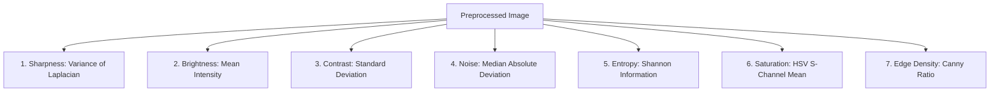
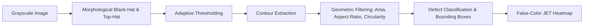

# Code & Algorithm Technical Explanation

This document provides a beginner-friendly, line-by-line technical breakdown of every major algorithm, mathematical formula, and design choice used in the system.

---

## 1. Feature Extraction Algorithms & Mathematical Formulas

The system computes **7 canonical numerical features** for every inspected image.

---

### Algorithm 1: Sharpness via Variance of Laplacian

* **What it does**: Quantifies how in-focus or blurry an image is.
* **Input**: 2D Grayscale matrix $I(x, y)$ of shape $(H, W)$.
* **Output**: A single non-negative floating-point number $\ge 0.0$.
* **Mathematical Formula**:
  $$\nabla^2 I(x, y) = \frac{\partial^2 I}{\partial x^2} + \frac{\partial^2 I}{\partial y^2}$$
  $$\text{Sharpness} = \text{Var}(\nabla^2 I) = \frac{1}{N} \sum_{x,y} \left(\nabla^2 I(x, y) - \mu_{\nabla^2 I}\right)^2$$
* **Intuition & Mechanism**:
  1. The Laplacian operator acts as a second-order spatial derivative filter. It measures the rapid rate of change in pixel intensity.
  2. In OpenCV, this is computed by convolving the image with the standard $3 \times 3$ kernel:
     $$K = \begin{bmatrix} 0 & 1 & 0 \\ 1 & -4 & 1 \\ 0 & 1 & 0 \end{bmatrix}$$
  3. When an edge is sharp, the difference between neighboring pixels is high, creating steep positive and negative peaks in the Laplacian output. This creates a wide spread (high variance $\sigma^2 > 200$).
  4. When an image is blurry, edges are smoothed out into gradual slopes. The Laplacian responses remain near zero, resulting in low variance ($\sigma^2 < 80$).
* **Limitations**: An image of a blank wall naturally has low variance even if it is perfectly in focus. This is why we combine it with edge density and machine learning.

---

### Algorithm 2: Brightness (Mean Luminance)

* **What it does**: Measures overall illumination level.
* **Mathematical Formula**:
  $$\mu = \frac{1}{N} \sum_{x=0}^{W-1} \sum_{y=0}^{H-1} I(x, y)$$
* **Intuition**: Calculates the average intensity on a scale from $0.0$ (pitch black) to $255.0$ (pure white). Values below $60.0$ indicate underexposure (shadow loss); values above $200.0$ indicate overexposure (blown-out highlights).

---

### Algorithm 3: Contrast (Standard Deviation)

* **What it does**: Measures dynamic range and tonal separation.
* **Mathematical Formula**:
  $$\sigma = \sqrt{\frac{1}{N} \sum_{x,y} (I(x, y) - \mu)^2}$$
* **Intuition**: Standard deviation captures how widely distributed the pixel intensities are across the grayscale spectrum. Flat, washed-out images have narrow distributions ($\sigma < 25$).

---

### Algorithm 4: Noise Estimation via Median Absolute Deviation (MAD)

* **What it does**: Isolates high-frequency stochastic sensor noise without confusing it with genuine structural edges.
* **Mathematical Formula**:
  $$\text{Residual } R = |I - \text{MedianBlur}(I, 3)|$$
  $$\text{MAD} = \text{median}\left(|R - \text{median}(R)|\right)$$
  $$\sigma_{\text{noise}} = 1.4826 \times \text{MAD}$$
* **Intuition & Mechanism**:
  1. A $3 \times 3$ median filter removes salt-and-pepper grain and high-frequency noise while preserving true edges.
  2. Subtracting the filtered image leaves behind only the high-frequency residual $R$.
  3. Standard deviation is sensitive to outliers (like true object borders). The **Median Absolute Deviation (MAD)** is a robust statistical scale estimator. Multiplying by $1.4826$ normalizes the estimate to match the standard deviation of a standard Gaussian distribution.

---

### Algorithm 5: Shannon Entropy (Information Content)

* **What it does**: Measures the randomness and information richness in the grayscale histogram.
* **Mathematical Formula**:
  $$p_i = \frac{\text{count of pixels with intensity } i}{N}$$
  $$H = - \sum_{i=0}^{255} p_i \log_2(p_i) \quad (\text{for } p_i > 0)$$
* **Intuition**: Measures information in bits ($0$ to $8$ bits). A solid gray image has $0$ bits of entropy. A natural, high-information surface typically has an entropy of $5.5$ to $7.8$ bits.

---

### Algorithm 6: Color Saturation

* **What it does**: Quantifies color vividness.
* **Mechanism**: Converts BGR to the HSV (Hue, Saturation, Value) color space. The S-channel represents chromatic purity on a $[0, 255]$ scale. The mean is normalized to $[0.0, 1.0]$. Pure monochrome/grayscale images have saturation $\approx 0.0$.

---

### Algorithm 7: Edge Density

* **What it does**: Calculates the proportion of pixels forming structural boundaries.
* **Mathematical Formula**:
  $$\text{Edge Density} = \frac{\sum \text{Canny}(I)}{N}$$
* **Mechanism**: Runs the Canny edge detector (Gaussian filter $\rightarrow$ Sobel gradient magnitude $\rightarrow$ Non-maximum suppression $\rightarrow$ Hysteresis thresholding). Measures the fraction of edge pixels over total pixels.

---

## 2. Visual Defect Detection Algorithms

### Morphological Filtering (Top-Hat & Black-Hat)

* **Top-Hat Transform**: $\text{TopHat}(I) = I - \text{Opening}(I)$. Isolates elements brighter than their surroundings.
* **Black-Hat Transform**: $\text{BlackHat}(I) = \text{Closing}(I) - I$. Isolates dark, narrow elements (like scratches or cracks) on lighter backgrounds.
* **Elliptical Structuring Element**: Using `cv2.MORPH_ELLIPSE` prevents rectangular edge bias and matches organic crack shapes.

### Geometric Shape Classifiers

For each segmented contour, we extract geometric invariant descriptors:

1. **Aspect Ratio**:
   $$\text{Aspect Ratio} = \frac{\max(\text{width}, \text{height})}{\min(\text{width}, \text{height})}$$
   - If $\text{Aspect Ratio} \ge 3.0 \rightarrow$ Classified as **`SCRATCH`** (thin, elongated line).

2. **Circularity**:
   $$\text{Circularity} = \frac{4 \pi \times \text{Area}}{\text{Perimeter}^2}$$
   - For a perfect circle, $\text{Circularity} = 1.0$.
   - If $\text{Circularity} > 0.65 \rightarrow$ Classified as **`BLEMISH`** (localized round spot).
   - If $\text{Circularity} < 0.35$ and $\text{Area} > 60 \rightarrow$ Classified as **`CRACK_LIKE`** (irregular branching perimeter).
   - Otherwise $\rightarrow$ Classified as **`CONTAMINATION_LIKE`**.

---

## 3. Decision & Report Engine Logic

The decision engine in [`report_generator.py`](file:///c:/Users/Lenovo/OneDrive/Desktop/AI-Powered%20Image%20Quality%20&%20Defect%20Detection/backend/app/core/report_generator.py) arbitrates between ML predictions and CV defect segmentations:

$$\text{Base Score} = 0.35 S_{\text{sharpness}} + 0.25 S_{\text{exposure}} + 0.15 S_{\text{noise}} + 0.15 S_{\text{contrast}} + 0.10 S_{\text{other}}$$
$$\text{Final Score} = \max\left(0, \text{Base Score} - \sum \text{Defect Penalties} - 5.0 \times \text{Defect Density}\right)$$

* **Label Rules**:
  - `DEFECTIVE`: High-severity defect detected OR $\ge 2$ defects OR ML predicted `DEFECTIVE` with $\ge 70\%$ confidence OR final score $< 60$.
  - `DEGRADED`: Exactly 1 minor defect OR moderate blur/noise issue OR ML predicted `DEGRADED` OR score $< 88$.
  - `ACCEPTABLE`: Score $\ge 88$, 0 defects, and ML predicted `ACCEPTABLE`.
