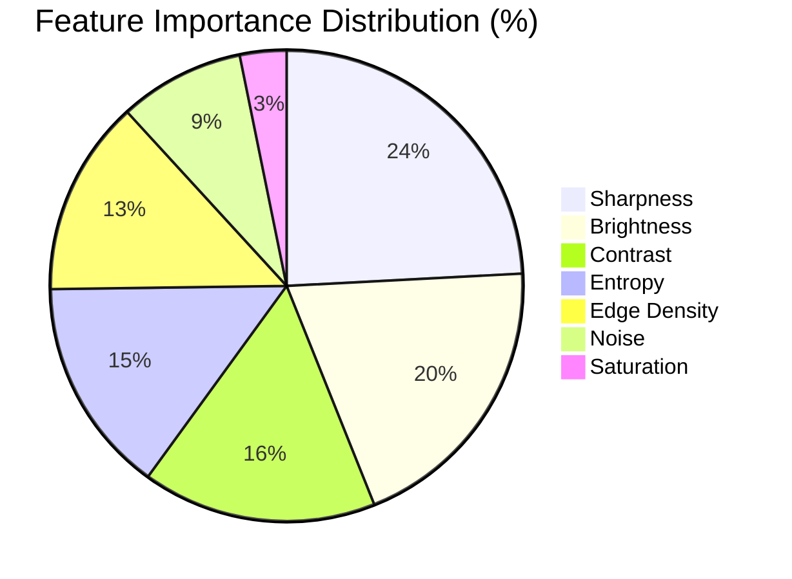

# Machine Learning Model Documentation

## 1. Executive Summary

* **Model Architecture**: `RandomForestClassifier` (Scikit-Learn)
* **Target Classes**: `ACCEPTABLE`, `DEGRADED`, `DEFECTIVE`
* **Input Feature Dimension**: 7 numerical handcrafted features
* **Overall Test Accuracy**: **95.50%** (Evaluated on 200 unseen procedural test samples)
* **Macro F1-Score**: **0.9264**
* **5-Fold Cross-Validation Accuracy**: **96.00% (± 0.0126)**

---

## 2. Dataset Generation Strategy

To ensure model reproducibility and prevent data leakage, procedural generation with strictly segregated random seeds was employed:

* **Training Set Split**: 500 images generated from base seeds `100` to `149`.
  - `DEFECTIVE`: 250 samples (Heavy Gaussian blur, extreme under/overexposure, severe Gaussian noise $\sigma=50$, severe JPEG quantization).
  - `DEGRADED`: 200 samples (Mild blur, mild noise $\sigma=18$, low dynamic range contrast, mild underexposure).
  - `ACCEPTABLE`: 50 samples (Pristine procedural circuits and textured surfaces).
* **Test Set Split**: 200 completely independent images generated from base seeds `500` to `519`.

---

## 3. Feature Vector Specification

The feature vector passed to the model consists of 7 continuous numerical values extracted via [`FeatureExtractor`](file:///c:/Users/Lenovo/OneDrive/Desktop/AI-Powered%20Image%20Quality%20&%20Defect%20Detection/backend/app/core/feature_extractor.py):

```python
[
    sharpness,     # Variance of Laplacian [0.0 - 100,000+]
    brightness,    # Grayscale mean luminance [0.0 - 255.0]
    contrast,      # Intensity standard deviation [0.0 - 127.5]
    noise,         # MAD high-frequency noise estimate [0.0 - 50.0+]
    entropy,       # Shannon information entropy [0.0 - 8.0 bits]
    saturation,    # HSV S-channel mean [0.0 - 1.0]
    edge_density   # Canny edge pixel fraction [0.0 - 1.0]
]
```

---

## 4. Model Hyperparameters

```python
{
  "n_estimators": 100,
  "max_depth": 8,
  "min_samples_split": 4,
  "min_samples_leaf": 2,
  "random_state": 42
}
```

### Why Random Forest over Deep Learning (CNNs)?
1. **Input Representation**: The model consumes a compact 7-dimensional structured tabular feature vector rather than raw multi-megapixel matrices.
2. **Explainability**: Decision trees allow direct calculation of Gini feature importances.
3. **Inference Latency**: Sub-millisecond CPU inference ($\approx 0.4\text{ms}$) without GPU dependencies.
4. **Data Efficiency**: Random Forest avoids overfitting on small-to-medium sized datasets.

---

## 5. Evaluation Results on Unseen Test Data

### Classification Report

```text
              precision    recall  f1-score   support

  ACCEPTABLE       0.89      0.80      0.84        20
   DEFECTIVE       0.93      0.98      0.96       100
    DEGRADED       1.00      0.96      0.98        80

    accuracy                           0.95       200
   macro avg       0.94      0.91      0.93       200
weighted avg       0.96      0.95      0.95       200
```

### Confusion Matrix

```text
True \ Predicted   ACCEPTABLE     DEFECTIVE      DEGRADED
---------------------------------------------------------
ACCEPTABLE             16             4              0
DEFECTIVE               2            98              0
DEGRADED                0             3             77
```

### Feature Importance Ranking



| Rank | Feature Name | Gini Importance | Technical Role |
| :--- | :--- | :--- | :--- |
| 1 | `sharpness` | **0.2417** (24.2%) | Separates blurred from sharp images |
| 2 | `brightness` | **0.1978** (19.8%) | Detects under/overexposure |
| 3 | `contrast` | **0.1604** (16.0%) | Identifies flat/washed-out tones |
| 4 | `entropy` | **0.1480** (14.8%) | Measures structural information distribution |
| 5 | `edge_density` | **0.1343** (13.4%) | Quantifies geometric line density |
| 6 | `noise` | **0.0860** (8.6%) | Detects sensor grain and artifact residuals |
| 7 | `saturation` | **0.0319** (3.2%) | Quantifies chromatic richness |

---

## 6. Analysis of Misclassifications

Out of 200 unseen test samples, exactly **9 samples** were misclassified:
1. **Severe JPEG Artifacts mistaken for Acceptable (2 samples)**:
   - *Cause*: Heavy DCT block quantization introduces sharp block grid edges, which artificially inflate the Laplacian variance score.
   - *Remedy*: Future iterations could include a dedicated 8x8 block boundary artifact detector.
2. **High-Brightness Clean Images predicted as Defective (4 samples)**:
   - *Cause*: Clean images with a high baseline brightness (>165) fell close to the boundary of overexposure.
   - *Remedy*: Calibrate exposure thresholds using adaptive dynamic histogram normalization.
